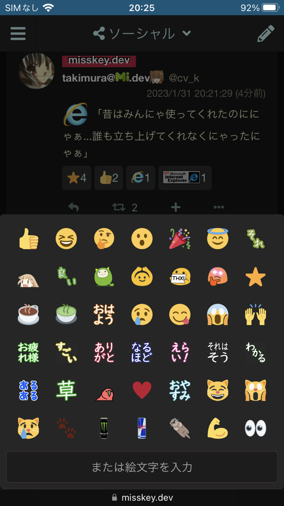

# リアクションパレットを画面下部に表示させる（Misskey v11 モバイル版モード用）

[README English](./README.md)

Misskey v11でモバイル版モードにしているときにリアクションパレットを画面下部に表示させるUserScriptです。

## インストール

### Chromium系ブラウザの場合

1. [MisskeyV11ReactionPickerExpandWidth.user.js](https://github.com/hidao80/UserScript/raw/main/MisskeyV11ReactionPickerExpandWidth/MisskeyV11ReactionPickerExpandWidth.user.js)をダウンロードします
2. 設定 > 拡張機能（`chrome://extensions/`）をクリックして「拡張機能」ページを開き、「デベロッパーモード」または「開発者モード」のスイッチをオンにします
3. ダウンロードした`MisskeyV11ReactionPickerExpandWidth.user.js`を「拡張機能」ページにドラッグ&ドロップします

### SafariやFirefoxの場合

UserScript管理拡張機能をインストール後、<https://github.com/hidao80/UserScript/raw/main/MisskeyV11ReactionPickerExpandWidth/MisskeyV11ReactionPickerExpandWidth.user.js> にアクセスし、ソースコードの外枠にある「Raw」ボタンをクリックします。

または[ここをクリックするとインストールします。](https://github.com/hidao80/UserScript/raw/main/MisskeyV11ReactionPickerExpandWidth/MisskeyV11ReactionPickerExpandWidth.user.js)

## スクリーンショット

## ライセンス

[MIT](/LICENSE)
